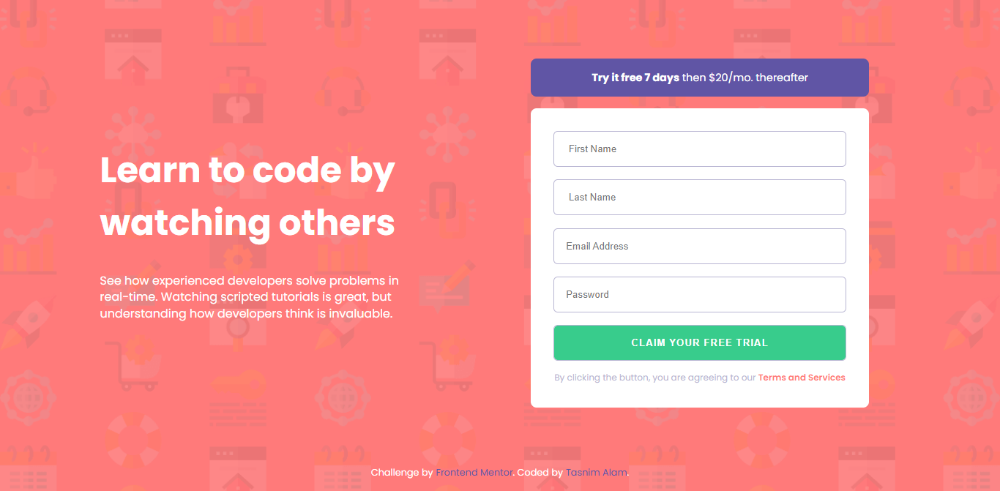
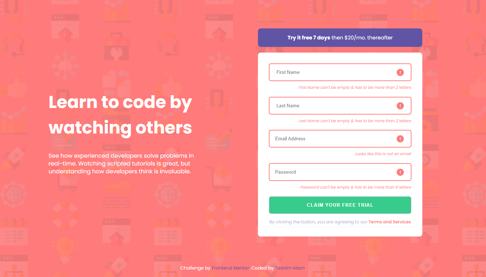
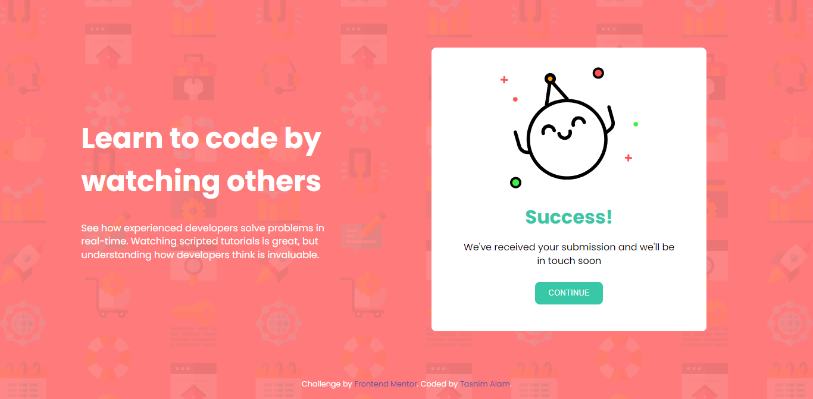

# Frontend Mentor - Intro component with sign up form solution

This is a solution to the [Intro component with sign up form challenge on Frontend Mentor](https://www.frontendmentor.io/challenges/intro-component-with-signup-form-5cf91bd49edda32581d28fd1). Frontend Mentor challenges help you improve your coding skills by building realistic projects.

## Table of contents

- [Overview](#overview)
  - [The challenge](#the-challenge)
  - [Screenshot](#screenshot)
  - [Links](#links)
- [My process](#my-process)
  - [Built with](#built-with)
  - [What I learned](#what-i-learned)
  - [Continued development](#continued-development)
  - [Useful resources](#useful-resources)
- [Author](#author)

## Overview

### The challenge

Users should be able to:

- View the optimal layout for the site depending on their device's screen size
- See hover states for all interactive elements on the page
- Receive an error message when the `form` is submitted if:
  - Any `input` field is empty. The message for this error should say _"[Field Name] cannot be empty"_
  - The email address is not formatted correctly (i.e. a correct email address should have this structure: `name@host.tld`). The message for this error should say _"Looks like this is not an email"_

### Screenshot






### Links

- Solution URL: [Add solution URL here](https://your-solution-url.com)
- Live Site URL: [Add live site URL here](https://your-live-site-url.com)

## My process

### Built with

- Semantic HTML5 markup
- CSS custom properties
- CSS Grid
- Vanilla JS

### What I learned

I learned form validation and got introduced with the concepts and use of regular expressions.

```html
<form onsubmit="return validateForm(event)" novalidate>
          <div class="inputContainer firstName">
            <input type="text" placeholder=" First Name" class="inputField"/>
            <div class="errorIcon">
              
            </div>
            <div class="errorMessage">
              <p>First Name can't be empty & has to be more than 2 letters</p>
            </div>
          </div>
```

```js
let hasErrors = false;

  for (let i = 0; i < inputElements.length; i++) {
    const element = inputElements[i];
    if (
      element.value.length < 2 ||
      (i === 2 && !/^[^\s@]+@[^\s@]+\.[^\s@]+$/.test(email)) ||
      (i === 3 && element.value.length < 8)
  
    ) {
      hasErrors = true;
      element.style.marginBottom = "12px";
      element.style.outline = "1px solid red";
      errorMessage[i].style.display = "block";
      errorIcon[i].style.display = "block";
    } else {
      element.style.marginBottom = "";
      element.style.outline = "";
      errorMessage[i].style.display = "none";
      errorIcon[i].style.display = "none";
    }
  }
};
```

### Continued development

I want to use regex for password validation so that it can check whether the password contains combination of uppercase and lowercase letters

### Useful resources

- [Web Dev Simplified ](https://www.youtube.com/watch?v=rhzKDrUiJVk&list=PLs0jC4DgSiPswGBozHflgzflAbqNUWKW-&index=61) - This tutorial helped me to get started with RegEx.
- [Regex](https://regexr.com/) - Here, one can practice regex

## Author
- Website - [Tasnim Alam](https://github.com/Tasnim005)
- Frontend Mentor - [@Tasnim005](https://www.frontendmentor.io/profile/Tasnim005)
